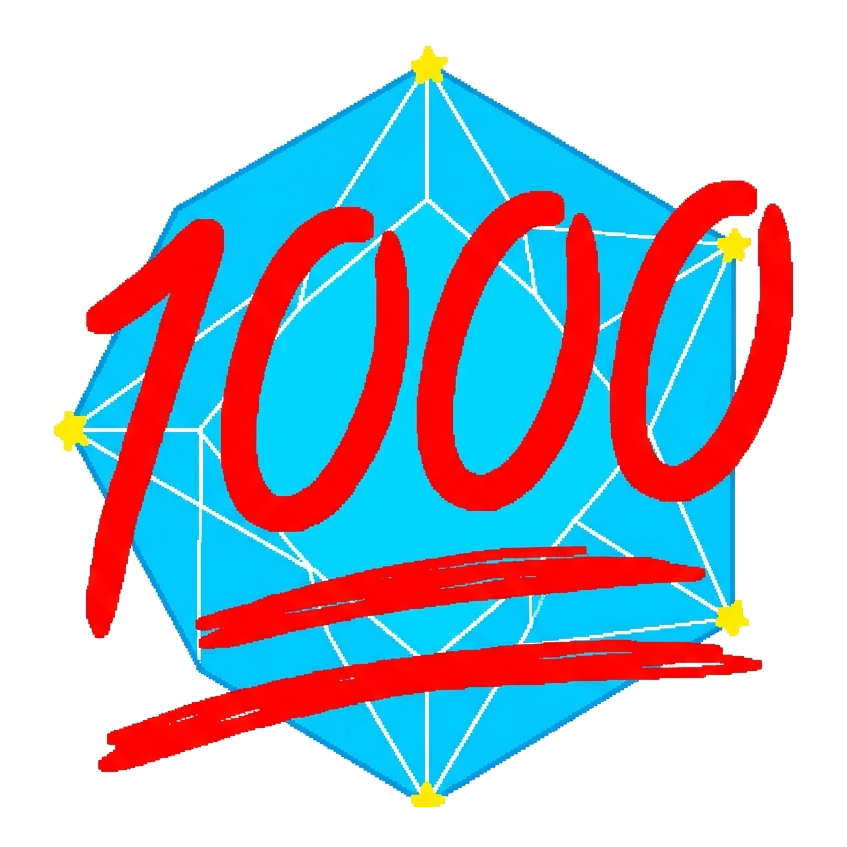

<div align="center">

  

  # Easy 1000Hz GCC

  **The 1-Click 1000Hz Polling Rate Adapter Overclocker for *Super Smash Bros. Melee* & Project Slippi**

  [-0078D6?style=for-the-badge&logo=windows&logoColor=white)](https://github.com/sheeshfr/Easy-1000hz-GCC)
  [-E02424?style=for-the-badge&logo=speedtest&logoColor=white)](https://github.com/sheeshfr/Easy-1000hz-GCC)
  [](https://github.com/sheeshfr/Easy-1000hz-GCC)
  [](https://github.com/sheeshfr/Easy-1000hz-GCC)

  <p align="center">
    <a href="#-quick-start"><b>Quick Start</b></a> •
    <a href="#-performance-comparison"><b>Performance</b></a> •
    <a href="#-hardware-support"><b>Hardware Support</b></a> •
    <a href="#-slippi--dolphin-setup"><b>Slippi Setup</b></a> •
    <a href="DOCUMENTATION.md"><b>Technical Documentation</b></a> •
    <a href="#-troubleshooting"><b>Troubleshooting</b></a> •
    <a href="#-credits--acknowledgments"><b>Credits</b></a>
  </p>

</div>

---

## 📌 Overview

**Easy 1000Hz GCC** is an open-source, automated utility designed to configure and overclock GameCube Controller USB adapters from the default **125 Hz (8ms)** to **1000 Hz (1ms)** on 64-bit Windows 10 & 11.

Historically, overclocking GameCube adapters required manual GUI navigation through Zadig and SweetLow's Setup, alongside **disabling Windows Memory Integrity (HVCI / Core Isolation)**. This tool eliminates the hassle:
- **1-Click Automated Setup:** Installs WinUSB and binds the 1000Hz kernel filter silently in under 2 seconds.
- **HVCI / Core Isolation Compatible:** Uses SweetLow's official **Microsoft WHQL-attested** `NoPatch` driver (`hidusbf.sys`). You **never** have to lower your operating system's security defenses.
- **No Reboot Required:** Cycles the USB device node dynamically using Windows Configuration Manager.

---

## ⚡ Performance Comparison

| Metric | Stock Adapter Driver | Easy 1000Hz GCC |
| :--- | :---: | :---: |
| **Polling Frequency** | 125 Hz | **1000 Hz** (1 kHz) |
| **Polling Interval** | 8.0 ms | **1.0 ms** |
| **Maximum Polling Delay** | ~8.0 ms | **≤ 1.0 ms** |
| **Latency Reduction** | Baseline (0 ms) | **~7.0 ms faster** |
| **Windows Memory Integrity (HVCI)** | Compatible | **Fully Compatible** |
| **Installation Complexity** | Manual 15-step GUI process | **1-Click Executable** |

---

## 🚀 Key Features

* ⚡ **True 1-Click Automation:** No manual command-line typing or driver checklist navigation. Run the tool, approve UAC, and your adapter is overclocked.
* 🛡️ **Zero Security Sacrifices:** Compatible with Windows 11 Hypervisor-Protected Code Integrity (HVCI / Core Isolation) enabled out of the box.
* 🎮 **Seamless Slippi & Dolphin Integration:** Employs standard WinUSB bindings that Dolphin / Slippi recognize instantly.
* 📦 **100% Self-Contained & Portable:** No external installers, Python runtimes, or system packages needed. Works directly from a USB stick or local drive.
* 🔄 **Clean One-Click Uninstaller:** Includes [`Uninstall_and_Reset.exe`](file:///r:/AI%20Coding/_Antigravity/Projects/Conversations%20w%20AI/GC_Adapter_Overclock/Uninstall_and_Reset.exe) to seamlessly revert all drivers and registry entries back to stock Windows defaults.

---

## 🎮 Hardware Support

| Adapter Model | Hardware ID | Status | Notes |
| :--- | :---: | :---: | :--- |
| **Official Nintendo Wii U Adapter** | `057E:0337` | **Supported** | Use black USB cable (grey is rumble-only). |
| **Official Nintendo Switch Adapter** | `057E:0337` | **Supported** | Identical internal hardware to Wii U model. |
| **Mayflash 4-Port Adapter** | `057E:0337` | **Supported** | Physical switch on rear **must** be set to **"Wii U"**. |
| **Mayflash 2-Port Adapter** | `057E:0337` | **Supported** | Switch must be set to **"Wii U"** mode. |
| **Generic / Clone 4-Port Adapters** | `057E:0337` | **Supported** | Clone adapters matching Nintendo VID/PID. |

---

## 📥 Quick Start

### 1. Connect Adapter
1. Plug your GameCube adapter into your PC.
   > [!IMPORTANT]
   > Ensure the **black USB cable** is plugged into a high-speed USB port directly on your motherboard or front I/O. The grey USB cable is only for controller rumble.
   > 
   > If using a **Mayflash adapter**, make sure the slider switch on the back is toggled to **"Wii U"** mode (not "PC").

### 2. Run the Overclocker
1. Download or clone this repository.
2. Double-click **`Auto_Overclock_1000Hz.exe`** (or `Click_Me_To_Overclock_1000Hz.bat`).
3. Click **Yes** when prompted by Windows User Account Control (UAC).
4. The tool will automatically:
   - Identify your adapter (`057E:0337`).
   - Configure WinUSB using the pre-packaged driver.
   - Install the WHQL-certified `hidusbf` kernel lower filter with `bInterval = 1`.
   - Soft-restart the USB hardware node.
5. Setup completes with a confirmation message in seconds!

---

## 🕹️ Slippi / Dolphin Setup

Once overclocked, configure Dolphin / Slippi to read native inputs at 1000 Hz:

1. Open **Slippi Launcher** (or Dolphin).
2. Open **Options** ➔ **Controller Settings**.
3. Set **Port 1** to **GameCube Adapter for Wii U**.
4. Click **Configure** next to Port 1:
   - Status should read: **Adapter Detected**.
   - Live Polling Rate will display: **~1000 Hz** (or 990–1010 Hz).
5. In Dolphin, navigate to **Config** ➔ **Slippi** and check **Reduce Timing Dispersion**.

> [!TIP]
> You can also run **`Verify_Adapter_Status.ps1`** (or `3_Check_Status.bat`) at any time to run a system diagnostic on your adapter, driver stack, and polling interval.

---

## 📖 Technical Documentation

For an in-depth breakdown of the driver mechanics, registry values, and Microsoft WHQL attestation details, see:

📄 **[DOCUMENTATION.md](DOCUMENTATION.md)** — Complete technical architecture guide, including:
- Why 125 Hz causes polling jitter in 60 FPS *Super Smash Bros. Melee*.
- How `hidusbf.sys` functions as a WDM lower filter beneath WinUSB.
- Windows 11 HVCI / Memory Integrity driver signature verification.
- Win32 `SetupAPI` and `cfgmgr32` dynamic re-enumeration without rebooting.
- Compilation and build instructions for `AutoOverclock.cs` and `Uninstaller.cs`.

---

## 🔄 Uninstallation

If you ever wish to restore your computer and adapter to 100% stock Windows defaults:

1. Run **`Uninstall_and_Reset.exe`** (or `Uninstall_and_Reset.bat`).
2. Click **Yes** on the UAC prompt.
3. The uninstaller will:
   - Stop and deregister the `hidusbf` service.
   - Delete `hidusbf.sys` from `C:\Windows\System32\drivers\`.
   - Clear all `LowerFilters` and `bInterval` values from your adapter registry.
   - Re-enumerate the device back to stock 125 Hz.

---

## ❓ Troubleshooting

<details>
<summary><b>Dolphin says "0 adapters detected"</b></summary>
<br>

- Ensure the **black USB cable** is plugged in.
- If using a Mayflash adapter, ensure the switch on the back is set to **"Wii U"** (not PC).
- Run `Auto_Overclock_1000Hz.exe` again to verify WinUSB binding.
</details>

<details>
<summary><b>Polling rate fluctuates around 980 Hz - 1010 Hz</b></summary>
<br>

- This is completely normal behavior for USB interrupt endpoints and full-speed packet timing. As long as it is near ~1000 Hz, you are operating with 1ms polling.
</details>

<details>
<summary><b>Do I need to re-run the tool after rebooting or changing USB ports?</b></summary>
<br>

- **Rebooting:** No. The driver and registry settings are permanently configured.
- **Plugging into a different USB port:** Windows assigns unique instance IDs per physical USB port. If you move your adapter to a different port, simply run `Auto_Overclock_1000Hz.exe` once on the new port.
</details>

<details>
<summary><b>Windows Defender or SmartScreen prompt</b></summary>
<br>

- Windows SmartScreen may show an unknown publisher dialog on newly compiled binaries. Click **More info** ➔ **Run anyway**. You can also inspect the full open-source C# code in `AutoOverclock.cs`.
</details>

---

## 📂 Repository Structure

```
Easy-1000hz-GCC/
├── Auto_Overclock_1000Hz.exe        # 1-Click compiled silent installer
├── AutoOverclock.cs                 # C# source code for installer & SetupAPI
├── Uninstall_and_Reset.exe          # 1-Click compiled uninstaller
├── Uninstaller.cs                   # C# source code for clean uninstallation
├── Verify_Adapter_Status.ps1        # Diagnostic script checking 1000Hz & WinUSB
├── Click_Me_To_Overclock_1000Hz.bat # Batch shortcut for 1-click install
├── Uninstall_and_Reset.bat          # Batch shortcut for uninstaller
├── 3_Check_Status.bat               # Diagnostic batch shortcut
├── Run_1000Hz_Setup.bat             # Fallback interactive wizard
├── zadig-2.9.exe                    # Bundled fallback Zadig driver installer
├── zadig.ini                        # Zadig configuration preset
├── app.manifest                     # UAC execution manifest (requireAdministrator)
├── logo.png                         # 1000 Shine project logo
├── README.md                        # Project documentation & GitHub overview
├── DOCUMENTATION.md                 # Deep-dive architecture & kernel guide
├── hidusbf/                         # SweetLow HIDUSBF driver suite
│   └── DRIVER/
│       └── AMD64_AS/
│           └── NoPatch/             # Microsoft WHQL-signed HVCI driver
└── usb_driver/                      # Certified WinUSB driver files
    ├── Orca_Controller.inf
    └── Orca_Controller.cat
```

---

## 📜 Credits & Acknowledgments

* **SweetLow (Alexander):** Creator of the incredible [HIDUSBF](https://github.com/LordOfMice/hidusbf) driver that made USB overclocking possible.
* **Battle Beaver Customs:** Crucial work attestation-signing the `NoPatch` driver for modern Windows 11 WHQL compliance.
* **Pete Batard / Akeo:** Author of [Zadig and libwdi](https://github.com/pbatard/libwdi) (GNU GPL v3).
* **Project Slippi:** Jas Laferriere (Fizzi) and the [Slippi Team](https://slippi.gg) for pioneering rollback netplay and revitalizing *Super Smash Bros. Melee*.
* **Dolphin Emulator:** The Dolphin development community for native GameCube adapter support.

---

<div align="center">
  <sub>Built for the Melee & Slippi community with ❤️. GameCube and Super Smash Bros. are trademarks of Nintendo.</sub>
</div>
